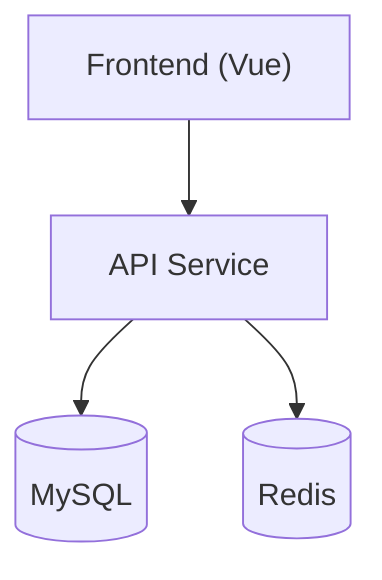
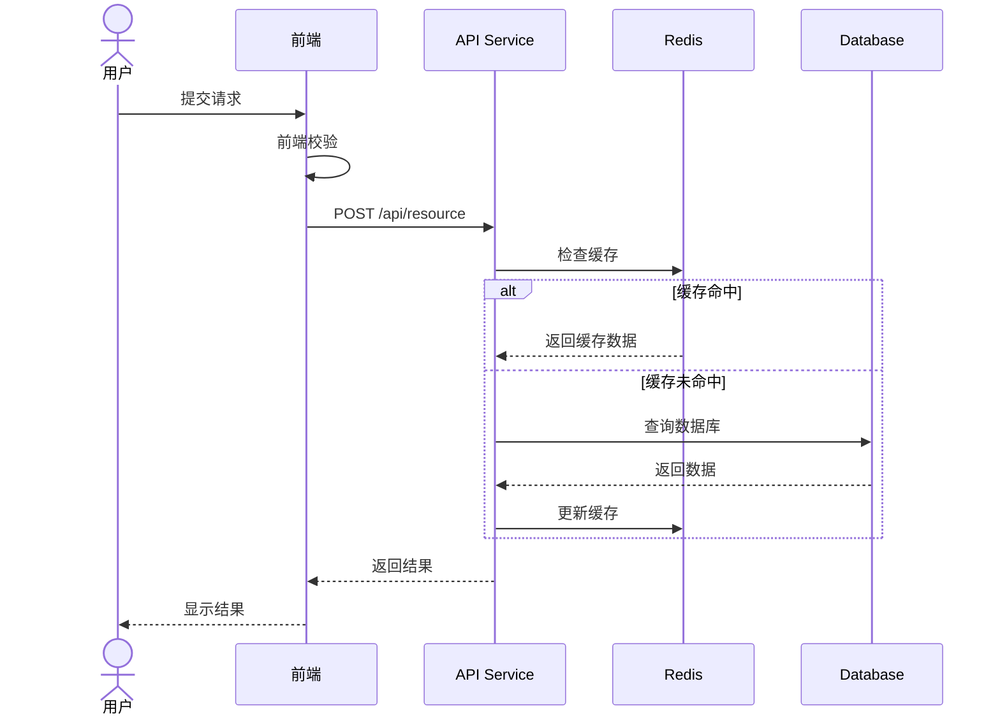
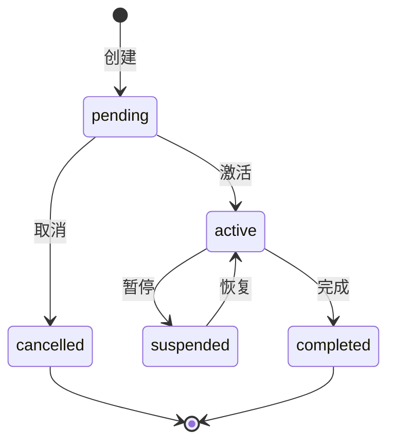

# [Feature Name] 设计文档

**作者：** [Author] | **日期：** [YYYY-MM-DD] | **状态：** 草稿 / 评审中 / 已批准

---

## 1. 概述

> 3-5 句话：是什么功能、解决什么问题、在系统中的位置、本期不包含什么。

**核心目标：**
- [目标 1]
- [目标 2]

**不在本期范围：**
- [排除项 1]

---

## 2. 技术对齐

### 2.1 技术栈

| 层 | 技术选型 | 备注 |
|---|---|---|
| 后端 | [框架 + 版本] | [新增依赖] |
| 前端 | [框架 + 版本] | [新增依赖] |
| 数据库 | [类型 + 版本] | — |
| 缓存 | [Redis 版本] | — |

### 2.2 项目结构影响

> 只列本次新增或修改的路径，不改动的不写。

**后端（新增/修改）：**
```
com.example/
├── controller/     # [具体文件]
├── service/        # [具体文件]
├── repository/     # [具体文件]
├── entity/         # [具体文件]
└── dto/            # [具体文件]
```

**前端（新增/修改）：**
```
src/
├── views/          # [具体文件]
├── components/     # [具体文件]
├── api/            # [具体文件]
└── store/          # [具体文件]
```

### 2.3 复用与集成点

- **[现有组件/服务]**：[如何复用或扩展]
- **[现有 API/数据库]**：[如何集成，连接到哪个 schema]

---

## 3. 架构设计

### 3.1 模块关系图



### 3.2 分层职责

| 层 | 职责 | 禁止 |
|---|---|---|
| Controller | 路由、参数校验、响应格式化 | 直接访问 DB、包含业务逻辑 |
| Service | 业务逻辑、事务管理 | 直接处理 HTTP、包含 SQL |
| Repository | 数据访问、查询封装 | 包含业务判断 |
| 前端 Store | 全局状态、缓存请求 | 直接调用 API |
| 前端 Service | API 请求封装 | 处理业务逻辑 |

---

## 4. 数据模型

### 4.1 ER 图

```mermaid
erDiagram
    USER ||--o{ ORDER : places
    ORDER ||--|{ ORDER_ITEM : contains

    USER { bigint id; varchar email; varchar role }
    ORDER { bigint id; bigint user_id; varchar status; decimal amount }
    ORDER_ITEM { bigint id; bigint order_id; bigint product_id; int qty }
```

### 4.2 核心表设计

#### `table_name`

| 字段 | 类型 | 说明 | 索引 |
|------|------|------|------|
| `id` | BIGINT PK | 自增主键 | PRIMARY |
| `field1` | VARCHAR(50) | 字段说明 | INDEX |
| `field2` | VARCHAR(100) | 字段说明 | UNIQUE |
| `created_at` | TIMESTAMP | 创建时间 | — |
| `updated_at` | TIMESTAMP | 更新时间 | — |

**关键索引：** `idx_field1_field2` 用于 [查询场景]

**迁移脚本：**
```sql
ALTER TABLE table_name ADD COLUMN new_field VARCHAR(64);
CREATE INDEX idx_new_field ON table_name(new_field);
```

### 4.3 核心数据结构

**后端实体（Java）：**
```java
@Entity
@Table(name = "table_name")
public class EntityName {
    @Id @GeneratedValue(strategy = GenerationType.IDENTITY)
    private Long id;

    @Column(nullable = false, length = 50)
    private String field1;
}
```

**DTO：**
```java
public class EntityRequest {
    @NotBlank(message = "字段不能为空")
    private String field1;
}

public class EntityResponse {
    private Long id;
    private String field1;
}
```

**前端类型：**
```typescript
interface Entity {
  id: number
  field1: string
  createdAt: string
}
```

---

## 5. API 设计

### 5.1 接口列表

| 方法 | 路径 | 说明 | 权限 | 幂等 |
|------|------|------|------|------|
| POST | `/api/v1/resource` | 创建资源 | USER | 是（idempotentKey） |
| GET | `/api/v1/resource` | 资源列表 | USER | 是 |
| GET | `/api/v1/resource/:id` | 资源详情 | 本人/ADMIN | 是 |
| PUT | `/api/v1/resource/:id` | 更新资源 | 本人 | 是 |
| DELETE | `/api/v1/resource/:id` | 删除资源 | 本人 | 是 |

### 5.2 非标准接口详情

> 只写有歧义或非常规的接口，标准 CRUD 只列表格即可。

**`POST /api/v1/resource`**

```jsonc
// Request
{ "field1": "value1", "idempotentKey": "client-uuid-xxx" }

// Response 201
{ "code": 0, "msg": "success", "data": { "id": 123, "field1": "value1" } }

// Error 400
{ "code": 40001, "msg": "参数校验失败", "errors": [{ "field": "field1", "message": "不能为空" }] }
```

### 5.3 统一响应 & 错误码

```jsonc
{ "code": 0, "msg": "success", "data": {} }      // 成功
{ "code": 40001, "msg": "错误信息", "errors": [] } // 失败
```

| Code | HTTP | 含义 | 前端处理 |
|------|------|------|----------|
| 0 | 200/201 | 成功 | — |
| 40001 | 400 | 参数校验失败 | 字段级提示 |
| 40101 | 401 | Token 过期 | 自动刷新，失败跳登录 |
| 40301 | 403 | 无权限 | Toast 提示 |
| 40401 | 404 | 资源不存在 | 跳转 404 页 |
| 40901 | 409 | 冲突/重复操作 | Toast 提示原因 |
| 50001 | 500 | 服务内部错误 | Toast + 上报 |

---

## 6. 前端设计

### 6.1 页面与路由

| 路由 | 页面组件 | 说明 | 权限 |
|------|----------|------|------|
| `/resource` | `ResourceListPage` | 资源列表 | USER |
| `/resource/new` | `ResourceCreatePage` | 创建资源 | USER |
| `/resource/:id` | `ResourceDetailPage` | 资源详情 | USER |

### 6.2 组件拆分

```
pages/
├── ResourceListPage
│   ├── ResourceFilterBar     # 筛选和搜索
│   ├── ResourceTable         # 列表主体
│   └── Pagination
├── ResourceCreatePage
│   └── ResourceForm
└── ResourceDetailPage
    └── ResourceInfo

stores/resourceStore
  state:   { list, current, loading, filters, pagination }
  actions: fetchList / fetchById / create / update / delete
  getters: filteredList / totalCount
```

### 6.3 页面原型

> 用 ASCII 图绘制关键页面的布局原型，只画布局不直觉或有特殊交互的页面。
> 绘制规范详见 [`references/ascii-diagram-conventions.md`](../references/ascii-diagram-conventions.md)

**原型要求**：
- 每个 Capability 至少 1 张核心页面原型
- 标注关键交互元素（按钮、表单、列表、弹窗）
- 状态切换页面需要画出不同状态的差异

```
┌──────────────────────────────────────────┐
│ 资源列表              [筛选 ▼] [搜索]    │
├────────────────────────┬───────┬──────────┤
│ 名称                   │ 状态  │ 操作     │
├────────────────────────┼───────┼──────────┤
│ Resource 1             │ 启用  │ [编辑][删除] │
└────────────────────────┴───────┴──────────┘
  共 12 条    [< 1 2 3 >]
```

**复杂交互的原型补充**（弹窗/抽屉/多步骤表单）：
```
┌─────────────────────────────────────┐
│ 创建资源                        [X] │
├─────────────────────────────────────┤
│ 名称：[________________]            │
│ 类型：[下拉选择 ▼]                  │
│ 描述：[________________]            │
│              [取消]  [确认创建]      │
└─────────────────────────────────────┘
```

---

## 7. 关键流程

> 只画多方协作或容易出错的流程。

### 7.1 核心业务流程



### 7.2 状态流转



---

## 8. 非功能需求

### 8.1 安全

| 关注点 | 方案 |
|--------|------|
| 认证 | JWT (RS256)，Access Token 2h，Refresh Token 7d |
| 权限 | RBAC：USER / ADMIN，接口级控制 |
| 数据隔离 | Service 层强制注入 `userId`，用户只能访问自己的数据 |
| 限流 | 写操作 10 次/分钟/用户；读操作 100 次/分钟/用户 |
| 幂等 | `idempotentKey` 唯一索引，相同 key 返回已有结果 |
| 防注入 | ORM 参数化查询，禁止拼接 SQL |
| XSS/CSRF | 输入校验 + 输出转义；SameSite Cookie + Token 验证 |

### 8.2 性能与缓存

| 场景 | 策略 | TTL | 失效条件 |
|------|------|-----|----------|
| 用户信息 | Redis 缓存 | 30min | 用户信息更新时主动失效 |
| 列表数据 | 不缓存（实时性要求高） | — | — |
| 热点数据 | Redis + 本地二级缓存 | 5min | 数据更新时主动失效 |

**数据库优化：** 复合索引 `(field1, field2, created_at)` 支撑列表筛选 + 排序；使用游标分页代替 OFFSET；避免 N+1 查询。

**前端优化：** 列表 > 100 条时虚拟滚动；搜索/滚动事件防抖节流。

### 8.3 降级策略

| 场景 | 策略 |
|------|------|
| Redis 不可用 | 降级直查 DB，写日志告警 |
| 外部服务超时 | 熔断，返回默认值或缓存数据 |
| MQ 发送失败 | 写本地事件表，定时重试，保证最终一致 |

---

## 9. 测试策略

| 层 | 覆盖率目标 | 重点 |
|---|---|---|
| Service（核心逻辑） | ≥ 80% | 业务逻辑、事务、边界条件 |
| Controller | ≥ 70% | 参数校验、权限、异常处理 |
| Repository | 关键查询 | 查询正确性 |
| 前端组件/Store | 核心路径 | Props、Actions、Getters |

**集成测试必测项：**
- [ ] API 端到端（含数据库）
- [ ] 权限隔离（A 不能访问 B 的数据）
- [ ] 缓存一致性
- [ ] 幂等性（相同 idempotentKey 重复提交）

**E2E 必测项：**
- [ ] 核心业务流程（创建 → 查询 → 更新 → 删除）
- [ ] 并发操作、重复提交

---

## 10. 实施计划

| 阶段 | 任务 | 预计时间 | 负责人 | 交付物 |
|------|------|----------|--------|--------|
| Phase 1 | 数据库迁移 & 配置 | 1.5 天 | [负责人] | 迁移脚本、配置更新 |
| Phase 2 | 后端 API 实现 | 3 天 | [负责人] | Controller / Service / Repository + 单元测试 |
| Phase 2 | 前端页面实现 | 3 天 | [负责人] | Vue 组件、Store、API 服务 |
| Phase 3 | 集成测试 & 性能优化 | 2 天 | [负责人] | 测试报告、优化记录 |
| Phase 4 | 部署 & 验证 | 1 天 | [负责人] | 部署文档、监控配置、回滚方案 |

**总预计时间：** 10.5 天

**关键风险：**

| 风险 | 缓解措施 | 应急方案 |
|------|----------|----------|
| 数据库迁移失败 | 测试环境先验证，准备回滚脚本 | 立即回滚 |
| API 接口频繁变更 | 前后端约定契约，前端用 Mock 并行开发 | 延期或砍需求 |
| 性能不达标 | 提前压测，预留优化时间 | 扩容 + 限流 |
| 外部服务不可用 | 熔断降级、缓存兜底 | 切换备用服务 |

---

## 11. 上线标准 & 监控

### 发布策略

| 阶段 | 环境 | 验证内容 | 回滚条件 |
|------|------|----------|----------|
| 1 | 测试环境 | 功能 + 集成测试 | 测试不通过 |
| 2 | 预发布环境 | 全链路 + 安全测试 | 安全漏洞、数据异常 |
| 3 | 生产（灰度 10%） | 错误率、响应时间 | 错误率 > 1% 或性能下降 > 20% |
| 4 | 生产（全量） | 持续监控 | 严重故障 |

### 成功标准

| 类型 | 指标 | 目标 |
|------|------|------|
| 功能 | 所有用例通过，无 P0/P1 Bug | ✓ |
| 性能 | API 平均响应时间 | < 200ms |
| 性能 | P99 响应时间 | < 1s |
| 稳定性 | 系统可用性 | ≥ 99.9% |
| 稳定性 | 错误率 | < 0.1% |
| 质量 | 核心业务代码覆盖率 | ≥ 80% |

---

## 附录

### 待定问题

- [ ] [问题 1]：[描述] — **待 [角色] 确认**
- [ ] [问题 2]：[描述] — **待 [角色] 确认**

### 外部依赖

- [ ] [依赖 1] v[版本]：[用途]
- [ ] [依赖 2] v[版本]：[用途]

### 参考资料

- [相关文档 / API 文档 / 技术规范]

### 变更记录

| 日期 | 版本 | 变更内容 | 作者 |
|------|------|----------|------|
| YYYY-MM-DD | v1.0 | 初始版本 | [作者] |