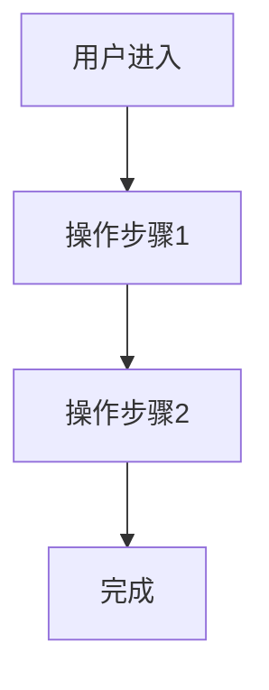

# PM Phase 3: PRD 撰写

## 目标

基于需求分析报告，生成结构化的产品需求文档。

## 步骤

### 0. 入口状态验证

```bash
ivy state show
```

验证当前阶段为 `prd`。读取 `docs/pm/analysis-report.md`。

### 1. 生成 PRD 文档

使用 `templates/prd.md` 模板，按以下结构撰写：

#### 1.1 背景与目标

- 为什么要做这个功能
- 解决什么用户痛点
- 期望达成的业务指标

#### 1.2 目标用户

- 用户画像（角色、场景、痛点）
- 用户使用场景描述

#### 1.3 功能范围

**包含的功能**：
- 功能 1：描述 + 优先级
- 功能 2：描述 + 优先级

**明确排除**：
- 功能 X：原因

#### 1.4 业务流程

使用 Mermaid 流程图描述核心业务流程：



#### 1.5 验收标准

每条验收标准使用 Given/When/Then 格式：

```
Given 用户已登录
When 用户点击"新建项目"按钮
Then 系统显示项目创建表单
And 表单包含名称、描述、截止日期字段
```

覆盖：
- 正向场景（正常流程）
- 异常场景（3 个以上：网络异常、权限不足、数据异常）
- 边界条件（最大值、最小值、空值）

#### 1.6 非功能需求

- 性能：响应时间 < 200ms
- 安全：权限校验、数据加密
- 兼容：浏览器/设备支持范围

#### 1.7 风险与依赖

| 风险 | 影响 | 概率 | 缓解措施 |
|------|------|------|---------|

### 2. PRD 质量自检

使用 `prompt/prd-checklist.md` 逐项检查。

### 3. 产出物

写入 `docs/prd/<feature-name>.md`。

### 4. 守卫检查

```bash
ivy guard prd --apply
```
